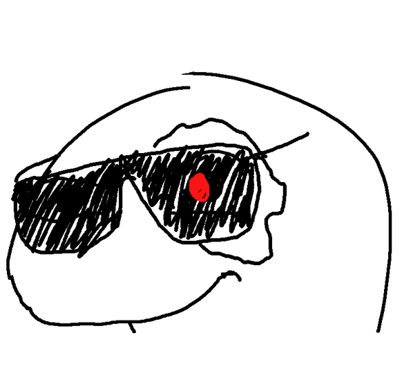
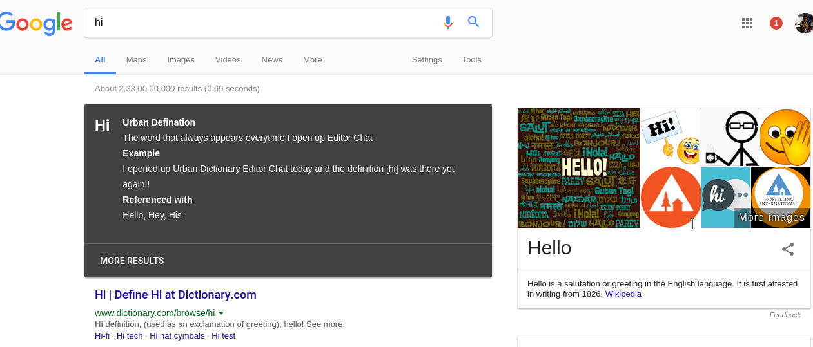

# Urbansaurus

Urbansaurus is a chrome extension I'm building that adds a urban dictionary widget to google search pages.

If you haven't heard of [Urban Dictionary](http://www.urbandictionary.com/), it's a collection of definations created by users, that describe lots of modern word implications.

## Install
Download zip > Chrome Settings > Extensions > Enable Developer Mode > Drag and Drop the zip.

If you want it on the chrome store, send me $5 xD
http://jajoosam.tech/bitcoin/

## Todo
- Make it work only with the `define` keyword
- Make it fit along with chrome's other cards
- Make it fit into chrome's dictionary card

Interested? Want to Collaborate?

email: redify@jajoosam.tech

twitter: @jajoosam

[Links here](https://notes.pinboard.in/u:jajoosam/ccffda8b6d7a18493c36)

[More dinos available here](https://github.com/hackclub/dinosaurs)