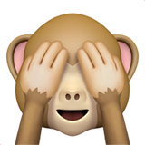

# Urbansaurus

Urbansaurus is a chrome extension I'm building that adds a urban dictionary widget to google search pages.

just search for `define word-goes-here`

If you haven't heard of [Urban Dictionary](http://www.urbandictionary.com/), it's a collection of definitions created by users, that describe lots of modern word implications.

## Install

https://chrome.google.com/webstore/detail/urbansaurus/nlfndljabdnkdgdmpfecdpcjoknnbjnd

**OR**

Download zip > Chrome Settings > Extensions > Enable Developer Mode > Drag and Drop the zip.
